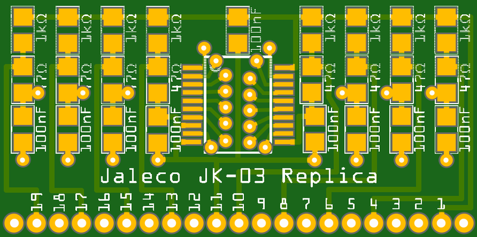

### JAMMA led-joystick

This is similar to the "USB led-joystick" boards that come with the ["LED Arcade DIY Parts" sets sold on Amazon](https://www.amazon.com/s/ref=nb_sb_noss_2?url=search-alias%3Daps&field-keywords=led+arcade+diy+parts), but made for JAMMA connections rather than a USB connection. The solder points in the center of the board are for quick-connect tabs (such as [Digi-Key part number 36-1211-ND](https://www.digikey.com/product-detail/en/keystone-electronics/1211/36-1211-ND/303565)) that mate with the connectors on a JAMMA harness.

**[AISLER Order Page](http://aisler.net/p/EAWAVACK)**

----

### Jaleco JK-03 Replica

This is a replacement for the JK-03 components found on Jaleco arcade boards. These fragile components are notorious for getting bent and breaking off, making the game unplayable. Now there's an easy way to fix it! Games that used these components include: Takeda Shingen / Samurai Fighter Shingen; P-47 Phantom Fighter / Liberty Fighter; Ninja Kazan; Hachoo; Holy Dragon; More Alpha; The Lord of King / The Astyanax; Rod Land / Rit & Tam; Phantasm / Avenging Spirit; Soldam; Kick-Off; Chimera Beast.

**[AISLER Order Page](http://aisler.net/p/FPNCWWSZ)**

----

### SyncStripper

This is a common modification for the widely available GBS-8200 RGB-to-VGA converter board. It passes the video sync signal through an LM1881 video sync separator which apparently improves synchronization issues.

**[AISLER Order Page](http://aisler.net/p/NVBQVLKW)**
