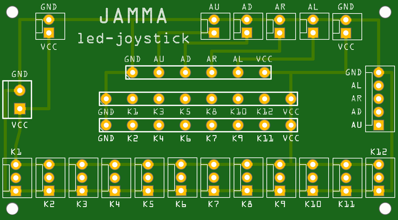

### JAMMA led-joystick

This is similar to the "USB led-joystick" boards that come with the ["LED Arcade DIY Parts" sets sold on Amazon](https://www.amazon.com/s/ref=nb_sb_noss_2?url=search-alias%3Daps&field-keywords=led+arcade+diy+parts), but made for JAMMA connections rather than a USB connection. The solder points in the center of the board are for quick-connect tabs (such as [Digi-Key part number 36-1211-ND](https://www.digikey.com/product-detail/en/keystone-electronics/1211/36-1211-ND/303565)) that mate with the connectors on a JAMMA harness.

**[AISLER Order Page](http://aisler.net/p/EAWAVACK)**
