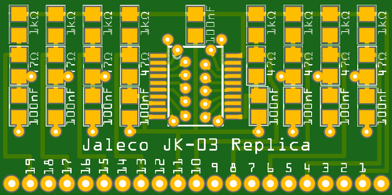

### Jaleco JK-03 Replica

This is a replacement for the JK-03 components found on Jaleco arcade boards. These fragile components are notorious for getting bent and breaking off, making the game unplayable. Now there's an easy way to fix it! Games that used these components include: Takeda Shingen / Samurai Fighter Shingen; P-47 Phantom Fighter / Liberty Fighter; Ninja Kazan; Hachoo; Holy Dragon; More Alpha; The Lord of King / The Astyanax; Rod Land / Rit & Tam; Phantasm / Avenging Spirit; Soldam; Kick-Off; Chimera Beast.

**[AISLER Order Page](http://aisler.net/p/FPNCWWSZ)**
